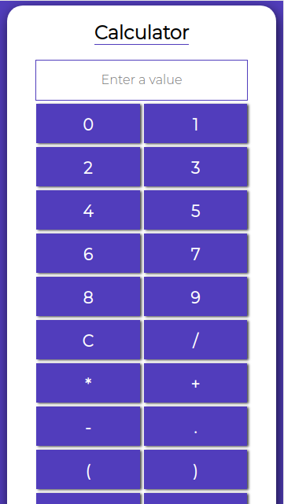

# calculator
Simple calculator made with JavaScript, Html and Css

This version is using the eval function, but I have two branches where I am working without it but they still have some bugs that I have to solve.   

